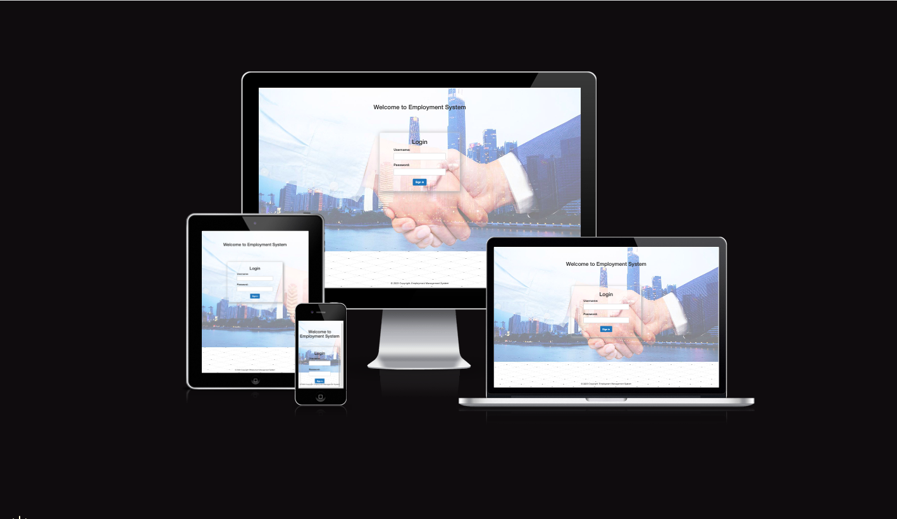
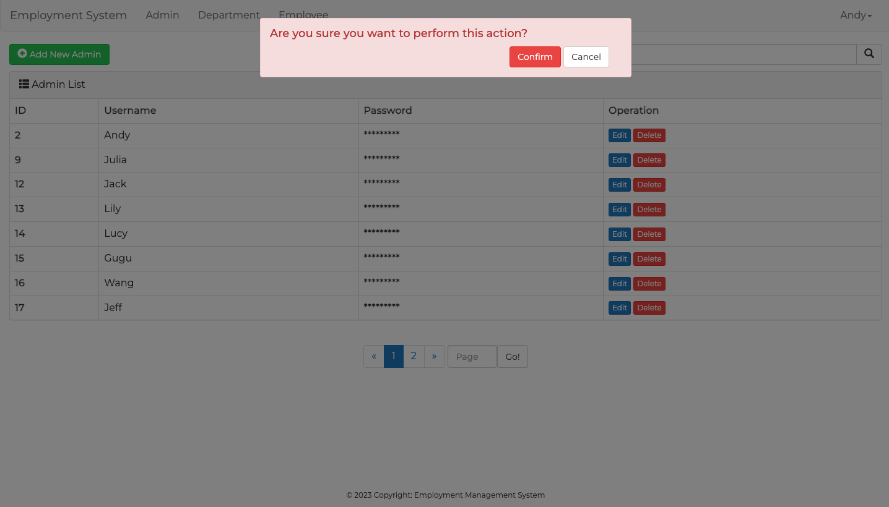

# Employment System

**Developer: Bin Ma**

💻 [Visit live website](https://employment-system.herokuapp.com/)

## Table of Contents
  - [About](#about)
  - [User Goals](#user-goals)
  - [Site Owner Goals](#site-owner-goals)
  - [User Experience](#user-experience)
  - [User Stories](#user-stories)
  - [Design](#design)
    - [Colors](#colors)
    - [Fonts](#fonts)
    - [Structure](#structure)
      - [Website pages](#website-pages)
      - [Database](#database)
    - [Wireframes](#wireframes)
  - [Technologies Used](#technologies-used)
  - [Features](#features)
  - [Validation](#validation)
  - [Testing](#testing)
    - [Manual testing](#manual-testing)
    - [Automated testing](#automated-testing)
    - [Tests on various devices](#tests-on-various-devices)
    - [Browser compatibility](#browser-compatibility)
  - [Bugs](#bugs)
  - [Heroku Deployment](#heroku-deployment)
  - [Credits](#credits)
  - [Acknowledgements](#acknowledgements)

### About

The Employment System is an online platform where users can manage employees.

### User Goals

- To set up the admin's account
- To be able to view edit and delete departments' title 
- To be able to view edit and delete employees' information
- To be able to search employees' detail 

### Site Owner Goals

- To provide a solution to allow users to create admin account to manage employee
- To provide a well-structured online platform with a simple operation interface
- Provide a modern application with a search function
- Fully responsive and accessible

## User Experience

### Target Audience
- The HR wants to manage the company's employees easily
- The owner of the company would like to acquire updated information about employees
- The department manager wishes to know the employee list in their department

### User Requirements and Expectations

- Fully responsive
- Accessible
- Simple operation interface

##### Back to [top](#table-of-contents)

## User Experience

### Target Audience
- Users that wish to book a table for a meal or a party with family and friends
- Past and new customers for the business
- Tourists visiting the area that are looking for a meal or a drink or both
- Fans visiting the area for a sports event or a music concert
- People employed in the area to eat and drink after work

### User Requirements and Expectations

- Fully responsive
- Accessible
- A welcoming design
- Social media
- Contact information
- Accessibility

##### Back to [top](#table-of-contents)

## User Stories

### Users

1.	As a User I can navigate across the site so that I can move to each feature of the site easily
2.	As a User I can log in and logout the website 
3.	As a User I can edit and delete employees' information
4.	As a User I can view all employee detail in one certain department
5.	As a User I can set up an account for new employee

### Site Owner  
6. As a Site Owner, I can provide a fully responsive site for my customers so that they have a good user experience
7. As a Site Owner, I can validate data entered into my site so that all submitted data is correct to avoid errors
8. As a Site Owner, I can provide a site where users can manage easily

##### Back to [top](#table-of-contents)

## Design

### Colors

I chose a light grey as the nav-bar background color and an extremely clean white color as the background color. The text color would be normal black. Because as an online working platform, the HR or employees' attention should not be abstracted by the colorful design. 

The colors I wanted to stay close to  [Coolors.co](https://coolors.co/)

See colour pallet

### Fonts

 The fonts selected were from Google Fonts, Montserrat wits sans-serif as a backup font.

#### Website pages

The site was designed for the user to be familiar with the classic office applications such as a navigation bar along the top of the pages and a hamburger menu button for smaller screens. Besides, the operation interface is easy to learn which will save plenty of time and costs for the owner. Because it is not necessary to train new employees on how to use this platform.

- The site consists of the following pages:
  - The login page allows the user to get access to the platform
  - The admin page shows the admin's username 
  - The admin edit page allows the user to update the admin's username and password saved from the database
  - The department page displays the current consist of departments in the company
  - The employee page can be used to add, edit and delete employee detail

 #### Database

- Built with Python and the Django framework with a database of a Postgres for the deployed Heroku version(production)
- The database ER diagram and table show all the fields stored in the database

Show diagram

Show table

### Wireframes
The wireframes were created using Balsamiq

Wireframes

## Technologies Used

### Languages & Frameworks

- HTML
- CSS
- Javascript
- Python
- Django

##### Back to [top](#table-of-contents)

## Features

### Login page
- The login page includes an input form that allows the user to type in username and password to get access to the main page. The submit button sends the form data to the backend. 

See feature images

### Navigation
- Fully Responsive
- On small screens switches to the hamburger menu
- Show the current user's name
- Logout the site
- Displayed on all pages

See feature images

### Footer
- Contains copyright
- Displayed across all pages

See feature images

### Admin
- Displayed all admin's username
- Allow users to add new admin, edit and delete exist admin
- Allow users to search for relevant information

See feature images

### Add New Admin
- Allow users to add new admin

See feature images

### Edit Admin
- Show the existing information of the admin
- Allow users to update existing information of the admin

See feature images

### Delete Admin
- Allow user to delete the selected admin from database
- The warning box reminds the user of the importance of data

See feature images

### Department
- Displayed all current company departments
- Allow users to add new departments, edit and delete existing department
- Search functions

See feature images

### Add New Department Title
- Allow users to add new department title

See feature images

### Employee
- Displayed all current company employees
- Allow users to add new employees, edit and delete existing employees
- Search functions

See feature images

### Add New Employees
- Allow users to add new employees

See feature images

### Pagination
- Add self-defined pagination class
- Pagination is used on the admin, department and employee pages
- Ensures the page is kept tidy as 10 items are displayed per page
- Indicate current page
- Add skip-page box to allow user skip to some certain page
  

See feature images

##### Back to [top](#table-of-contents)

## Validation

The W3C Markup Validation Service

Login

Admin

Add New Admin

Department

Create Department Title

Employee

Add New Employee

### CSS Validation
The W3C Jigsaw CSS Validation Service

Style.css

### JavaScript Validation
JSHint JS Validation Service

Script.js

